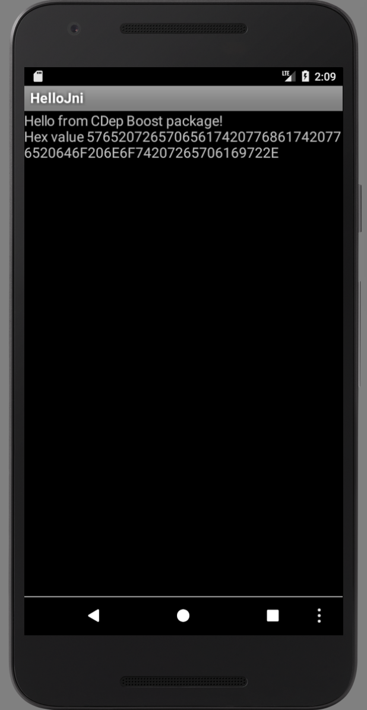

# CDep on Android Studio using ndk-build Integration
This is a sample project that uses Boost (http://boost.org) in an Android Gradle project using the [CDep](https://github.com/jomof/cdep) dependency management tool to download the Boost package rather than building it. 



## Instructions

All you need to do is clone this project, run CDep, and build.

```
git clone https://github.com/jomof/ndk-build-meet-cdep
cd ndk-build-meet-cdep
./cdep  # Downloads dependencies referenced in cdep.yml
./gradlew assemble
```
You can also open the project in Android Studio and run it.

